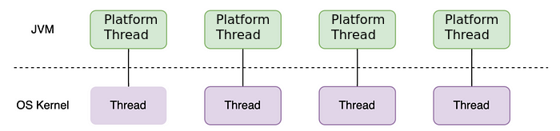
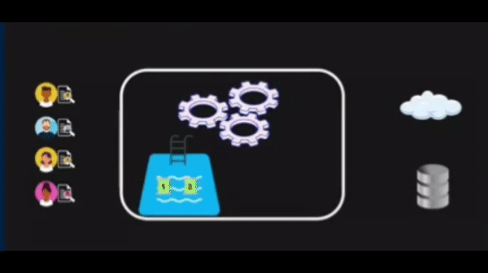
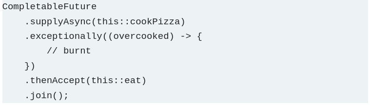
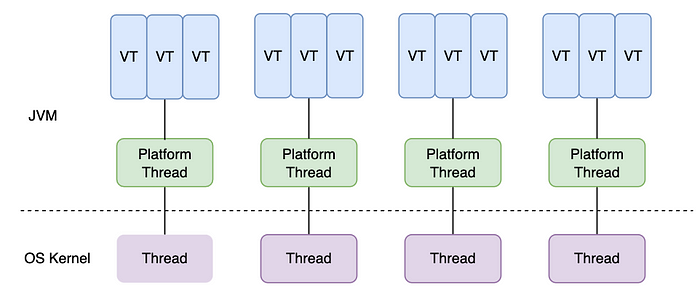
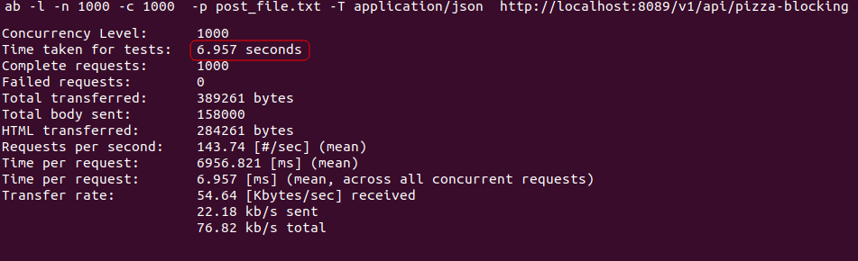
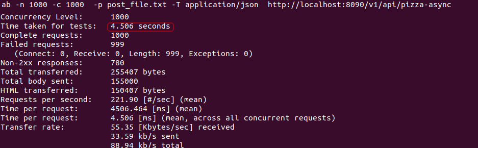
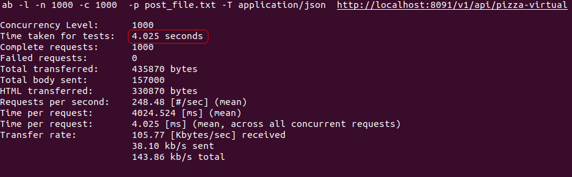

## Índice de contenidos
* [Artículo sobre los Hilos Virtuales](#item1)
* [Prueba de concepto con SpringBoot](#item2)

# Java 21 y los Hilos Virtuales

El anuncio del lanzamiento de Java 21 en Septiembre de este año por parte de Oracle trajo consigo una innovación notable: la incorporación completa de los Hilos Virtuales ([JEP 444](https://openjdk.org/jeps/444)), marcando un contraste con las versiones previas, Java 19 y Java 20, donde esta característica se encontraba en modo "preview".

Pero, ¿qué son exactamente los Hilos Virtuales y qué soluciones ofrecen?

Para comprenderlo, repasemos la historia de Java

### Platform Threads

Antes de la llegada de los Hilos Virtuales, los hilos que conocemos, **java.lang.Thread**, estaban asociados en una relación 1:1 con los hilos del sistema operativo. Sin embargo, estos hilos tradicionales resultaban ser bastante "pesados". A lo largo de la evolución de Java, la cantidad limitada de hilos disponibles se convertía en un cuello de botella constante.

Este obstáculo se hacía evidente al trabajar con servidores HTTP, donde se empleaba un hilo por petición, conocido como el estilo **thread-per-request**. A pesar de sus ventajas en simplicidad de programación y debug, surgían problemas de escalabilidad cuando las peticiones aumentaban significativamente en frecuencia y complejidad, con operaciones bloqueantes como solicitudes a bases de datos y conexiones a otros servidores.

  

### Programación Asincrónica

Para abordar estos problemas, el equipo de Java desarrolló una API para la programación asincrónica, abandonando el modelo de un hilo por solicitud en favor del uso compartido de hilos. Se introdujeron los "thread-pools" y operaciones no bloqueantes como los Future (Java 1.5) y posteriormente los mejorados **CompletableFuture** (Java 8), aparentemente superando las limitaciones anteriores. No obstante, esta transición trajo consigo nuevos desafíos:

- Requiere adoptar un nuevo paradigma de programación más complejo.
- Dificultades para debuggear el código.
- Propensión a los callback hell
- Las herramientas de monitoreo como profilers no ofrecen información precisa debido a la ejecución de una solicitud por múltiples hilos. Lo mismo con los stack-traces.

Además, los hilos seguían siendo pesados por lo tanto su Context Switching también. Aparecen problemas de seguridad entre hilos, como el riesgo de filtración de datos entre tareas sumado a problemas de control del tiempo de vida de los hilos en algunos casos imposibles de interrumpir.

## Proyecto Loom y los Hilos Virtuales

Es aquí donde Java se sumergió en una revisión fundamental de su plataforma con el Proyecto Loom. El líder del proyecto, **Ron Pressler**, ya había explorado una solución años atrás (en 2015) con los Quasar Fibers.

Esta es la definición de los Hilos Virtuales según Ron:

*"Desde la perspectiva del programador de Java, al sentarse a escribir y ejecutar su código, los hilos virtuales son simplemente hilos. Pero bajo la superficie, a diferencia de los hilos de hoy en día, a los que hemos comenzado a llamar hilos de plataforma, no se mapean uno a uno con los hilos del sistema operativo. Entonces, un hilo virtual no es un envoltorio alrededor de un hilo del sistema operativo. Más bien, es una construcción en tiempo de ejecución, es algo que el sistema operativo desconoce*.

*Bajo la superficie, durante el tiempo de ejecución, las bibliotecas y la máquina virtual mapean muchos de esos hilos virtuales, incluso millones, a un conjunto muy pequeño de hilos del sistema operativo. Entonces, desde la perspectiva del sistema operativo, tu programa podría estar ejecutando 8 o 32 hilos, pero desde tu perspectiva, estará ejecutando un millón de hilos y esos hilos serán virtuales"*

## Conclusiones

Los Hilos Virtuales mantienen la simplicidad del estilo de hilo por solicitud, optimizando recursos. Benefician a desarrolladores ofreciendo APIs compatibles con el diseño de la plataforma sin comprometer la escalabilidad.

## Bibliografía

- omgzui. (2022). How to Use Java 19 Virtual Threads. Recuperado de https://medium.com/javarevisited/how-to-use-java-19-virtual-threads-c16a32bad5f7

- Voxxed Days Luxembourg. (Julio 2023). Async Showdown: Java Virtual Threads vs. Kotlin Coroutines (Riccardo LIPPOLIS). Recuperado de https://www.youtube.com/watch?v=sAwiwFdB0HY

- InfoQ. (Mayo 2021). Java Project Loom [Podcast]. Recuperado de https://www.infoq.com/podcasts/java-project-loom/
  Coreen Yuen. (Julio 2017). A Node developer’s perspective on Java promises. Recuperado de https://www.qualtrics.com/eng/node-developers-perspective-java-promises

# Spring Boot Virtual Threads POC

Este repositorio contiene:

1 - Una prueba de concepto (POC) que demuestra la implementación de hilos virtuales en una aplicación con Spring Boot 3.
    *[spring-boot-3-java-21-virtual-thread](spring-boot-3-java-21-virtual-thread)*

2 - La misma implementación pero con hilos tradicionales: [spring-boot-3-java-17-platform-thread](spring-boot-3-java-17-platform-thread)

3 - Una implementación mediante programación asincronica (utilizando **CompletableFuture**): [spring-boot-3-java-17-async-platform-threads](spring-boot-3-java-17-async-platform-threads)

## ✨ Características

- Implementación de hilos virtuales en una aplicación Spring Boot.
- Ejemplos y casos de uso para comprender el funcionamiento.

## 📋 Requisitos

- Java JDK 21 o superior.
- Maven 3.6 o superior.
- Docker Compose 2.21.0 o superior.
- ApacheBench 2.3 (Si querés testear las aplicaciones)

## 🚀 Instalación y Uso

1. **Clona este repositorio:** `git clone https://github.com/WalterDotto/spring-boot-virtual-threads-poc.git`
2. **Accede al directorio del proyecto:** `cd spring-boot-virtual-threads-poc`
3. **Ejecuta las aplicaciónes:** `docker compose down && docker compose build && docker compose up -d && docker compose logs -f`

### 💡 Ejemplo de Uso

Una vez que las aplicaciones estén en funcionamiento podrás acceder a cada una de ellas mediante estas URLs:

- **Platform Threads:**  `POST http://localhost:8089/v1/api/pizza-blocking`
- **Async Platform Threads:**  `POST http://localhost:8090/v1/api/pizza-async`
- **Virtual Threads:**  `POST  http://localhost:8091/v1/api/pizza-virtual`

Para testear cada una de ellas podes hacerlo mediante **ApacheBench**

- **Platform Threads:**  `ab -l -n 1000 -c 1000  -p post_file.txt -T application/json  http://localhost:8089/v1/api/pizza-blocking`
- **Async Platform Threads:**  `ab -n 1000 -c 1000  -p post_file.txt -T application/json  http://localhost:8090/v1/api/pizza-async`
- **Virtual Threads:**  `ab -l -n 1000 -c 1000  -p post_file.txt -T application/json  http://localhost:8091/v1/api/pizza-virtual`

## Resultados de ApacheBench

*Se realizó una prueba ejecutando 1000 requests en simultáneo* 

1. **Platform Threads:**

2. **Async Platform Threads:**

3. **Virtual Threads:**

